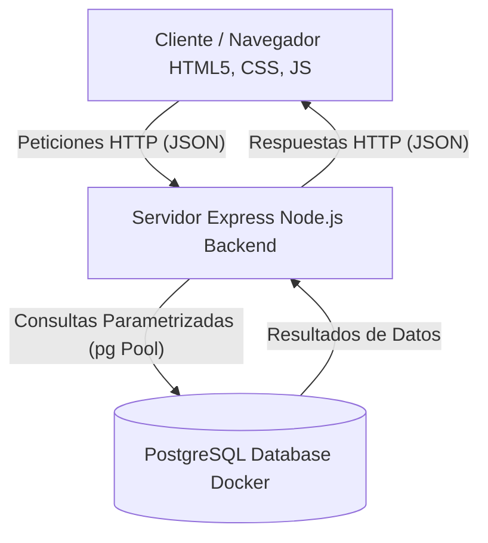
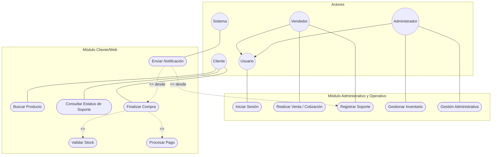

# UbuntuStore - Sistema de Gestión Integral

## Información del Producto
**UbuntuStore** es una solución tecnológica diseñada para la gestión integral y el control administrativo de tiendas de tecnología (venta de hardware, software y servicios de soporte técnico). Consiste en un sistema de tipo escritorio que automatiza procesos transaccionales de venta en punto de venta (POS), control de inventario en tiempo real con alertas de existencias mínimas, bitácora de órdenes del taller de soporte técnico, cotizador de ensambles a la medida, facturación y reportes de caja (ingresos vs. egresos).

---

## Integrantes del Equipo

1. **Godinez Barajas Jorge Antonio**
2. **López Álvarez Diego**
3. **Mendoza Villa Jesús Enrique**
4. **Sánchez Torres Ángel Horacio**

* **Profesor:** Fidel Bojórquez Solis
* **Grado y Grupo:** 2-2
* **Facultad:** Facultad de Informática Culiacán (FIC)
* **Institución:** Universidad Autónoma de Sinaloa (UAS)


---

## Contenido

### 1. Introducción
El proyecto **UbuntuStore** surge a partir de las necesidades operativas de un establecimiento comercial dedicado a la venta de hardware, software y soporte técnico especializado. Previo a la propuesta de este sistema, la tienda operaba mediante controles manuales o con herramientas desvinculadas entre sí. Esto resultaba en problemas críticos como:
* **Descontrol de Inventario:** Falta de visibilidad de las existencias reales en bodega y ausencia de avisos cuando un producto de alta rotación se agotaba.
* **Inconsistencia Financiera:** Falta de reportes diarios consolidados de caja, cruzando compras a proveedores y ventas netas, dificultando el cálculo de utilidades.
* **Trazabilidad en Reparaciones:** Ausencia de un estado claro del progreso en soporte técnico (recibido, en diagnóstico, reparado, entregado), mermando la confianza del cliente.
* **Fuga de Información:** Carencia de un registro confiable del desempeño del personal y auditorías en el sistema.

Con esta aplicación, se centralizan los procesos de ventas, taller de soporte y almacén en un único entorno digital seguro con asignación de roles.

---

### 2. Resumen del Sistema
El sistema automatiza el ciclo operativo completo de la tienda a través de las siguientes metas:
* **Objetivo General:** Desarrollar una aplicación funcional mediante JavaScript, HTML5/CSS y PostgreSQL para el control eficiente de los procesos comerciales y técnicos de UbuntuStore, facilitando la toma de decisiones basada en información precisa y oportuna.
* **Objetivos Específicos:**
  * Diseñar un esquema relacional optimizado en PostgreSQL que garantice la integridad transaccional e histórica de las operaciones.
  * Diseñar una interfaz responsiva, moderna e intuitiva con un esquema visual tipo "centro de mando técnico" oscuro.
  * Programar módulos transaccionales y de consulta ágiles, tales como el inventario interactivo, punto de venta multicanal y bitácora técnica de reparaciones.
  * Establecer un mecanismo de seguridad y control mediante roles (Administrador y Vendedor) y bitácoras de auditoría de movimientos.

---

### 3. Requisitos

#### a. Requisitos Funcionales y No Funcionales

##### Requisitos Funcionales (RF)
A continuación, se listan los requisitos funcionales del sistema mapeados a su identificador:

| Código | Requisito | Descripción |
| :--- | :--- | :--- |
| **RFIS-01** | Inicio de Sesión | El sistema mostrará un formulario de inicio de sesión seguro para introducir credenciales. |
| **RFA-02** | Autenticación | El sistema comprobará las credenciales con cifrado en la base de datos. |
| **RFCR-03** | Control de Roles | Restricción de acceso a menús y funciones específicas (Administrador vs Vendedor). |
| **RFI-04** | Inventario | Permitirá realizar altas, bajas, consultas y modificaciones (CRUD) de productos en el catálogo. |
| **RFCS-05** | Clasificación de Stock | Posibilidad de agrupar los artículos en categorías (componentes, laptops, software, etc.). |
| **RFME-06** | Monitoreo de Existencias | Alertas visuales automáticas cuando el stock de un producto llegue a su nivel mínimo. |
| **RFPV-07** | Procesamiento de Venta | Módulo POS para calcular totales, impuestos y procesar transacciones. |
| **RFCP-08** | Comprobante de Pago | Generación de tickets de venta con opción de impresión. |
| **RFAI-09** | Actualización de Inventario | Deducción automática del stock en tiempo real al concretarse una venta. |
| **RFST-10** | Soporte Técnico | Registro de órdenes de servicio indicando fallas del equipo del cliente. |
| **RFAR-11** | Asignación de Reparación | Asignación de técnicos y registro de piezas de reemplazo y costos asociados. |
| **RFHS-12** | Historial de Soporte | Bitácora digital que rastrea los estados del dispositivo en tiempo real. |
| **RFGC-13** | Garantías de Clientes | Base de datos de clientes frecuentes para vinculación de garantías y lealtad. |
| **RFH-14** | Historial | Consulta de historial de servicios y transacciones previas por cliente. |
| **RFF-15** | Facturación | Registro de facturas de compras a proveedores para actualizar el inventario y costo base. |
| **RFP-16** | Proveedores | Módulo para control y seguimiento de cuentas por pagar a proveedores. |
| **RFRC-17** | Reporte de Caja | Función de "corte de caja" diario de ingresos y egresos de efectivo. |
| **RFP-18** | Cotizaciones | Herramienta cotizadora que suma costos de componentes individuales para ensambles. |
| **RFA-19** | Administración | Gestión de perfiles de empleados y asignación/revocación de permisos. |
| **RFAM-20** | Auditoría de Movimientos | Registro persistente de acciones realizadas en el sistema por motivos de seguridad. |
| **RFRU-21** | Registro de Usuarios | Capacidad de crear nuevos usuarios con contraseñas encriptadas (bcryptjs). |
| **RF-UX-01**| Buscador de Productos | Búsqueda rápida de artículos por descripción o nombre (ej. "Ryzen 7"). |
| **RF-UX-02**| Cantidades en Carrito | Ajuste dinámico de cantidades (aumentar, reducir, eliminar) dentro de la vista del carrito. |
| **RF-UX-03**| Cálculo de Envío | Cálculo automático de tarifas de entrega mediante el ingreso del código postal. |
| **RF-UX-04**| Resumen de Compra Previo | Desglose claro de productos, impuestos y total antes de procesar el pago. |
| **RF-UX-05**| Confirmación por Correo | Envío automático de comprobantes digitales por correo electrónico tras ventas o servicios. |
| **RF-UX-06**| Estatus de Reparación | Consulta externa mediante folio de servicio para visualizar el estado de equipos. |
| **RF-UX-07**| Lista de Deseos (Alerta) | Suscripción para recibir notificaciones cuando artículos agotados vuelvan a tener stock. |
| **RF-UX-08**| Recuperación de Contraseña | Opción de restablecimiento seguro de clave por correo electrónico. |
| **RF-UX-09**| Historial de Pedidos Personal | Sección de cliente para consultar compras anteriores y estado de garantías. |

##### Requisitos No Funcionales (RNF)
| Código | Requisito No Funcional | Descripción |
| :--- | :--- | :--- |
| **RNFTA-01** | Tipo de Aplicación | Aplicación robusta con interfaz intuitiva de tipo escritorio. |
| **RNFST-02** | Stack Tecnológico | Desarrollado usando HTML5, Vanilla CSS y JavaScript para la lógica. |
| **RNFMD-03** | Motor de Datos | Uso de PostgreSQL 16 para el almacenamiento de datos relacionales integrados. |
| **RNFF-04**  | Fiabilidad | Garantía de integridad referencial para evitar inconsistencias financieras. |
| **RNFEU-05** | Experiencia de Usuario | Interfaz moderna, responsiva, con tema oscuro (Canvas Obsidian) y baja fatiga visual. |
| **RNFEB-06** | Eficiencia de Búsqueda | Filtrados reactivos en base de datos para tiempos de respuesta menores a 1 segundo. |
| **RNFCP-07** | Capa de Protección | Encriptación de contraseñas mediante bcryptjs y restricción a nivel API de rutas por rol. |

#### b. Requisitos Técnicos
* **Front-End:** 
  * Estructura semántica en HTML5.
  * Estilos premium en Vanilla CSS aplicando la paleta de diseño técnico oscuro (Canvas Obsidian, Surface Obsidian, Calibrated Copper) con fuentes sans-serif para controles generales y tipografía monospace (`JetBrains Mono`) para números, precios, códigos e historial.
  * Interactividad y lógica construidas con JavaScript (ES6+).
* **Back-End:**
  * Servidor REST API desarrollado en **Node.js** con el framework **Express**.
  * Autenticación basada en sesiones seguras y encriptación de contraseñas con **bcryptjs**.
* **Base de Datos:**
  * Motor de base de datos relacional **PostgreSQL 16** (utilizando el cliente nativo `pg` con conexión Pool).
* **Infraestructura de Desarrollo:**
  * Contenedores con **Docker** y **Docker Compose** para orquestar y desplegar el servicio de PostgreSQL de manera portable, cargando automáticamente la base de datos mediante scripts SQL (`schema.sql`, `seed.sql`).
  * Control de versiones con **Git**.

#### c. De Arquitectura del Sistema
El sistema sigue una arquitectura cliente-servidor desacoplada. La interfaz web interactúa directamente con el servidor Express mediante solicitudes REST HTTP en formato JSON. El backend procesa las solicitudes, valida los permisos de rol del usuario correspondiente y ejecuta consultas parametrizadas en la base de datos PostgreSQL.



A continuación se presenta la matriz de módulos y su conexión técnica basada en los requerimientos funcionales:

| Módulo | RF Principal | Conexión Técnica / Lógica | Requisitos Relacionados |
| :--- | :--- | :--- | :--- |
| **Acceso y Seguridad** | RFIS-01 | Punto de entrada único que activa la validación de identidad y el perfil de usuario. | RFA-02, RFCR-03, RF-UX-08 |
| **Catálogo e Inventario** | RFI-04 | Base de datos de productos que alimenta tanto a la tienda física como a la web. | RFCS-05, RFME-06 |
| **Ventas (Omnicanal)** | RFPV-07 | Proceso central que une la intención de compra (Carrito) con la salida de mercancía. | RFCP-08, RFAI-09, RF-UX-02, RF-UX-04 |
| **Soporte Técnico** | RFST-10 | Ciclo de vida del servicio desde la recepción del equipo hasta su entrega. | RFAR-11, RFHS-12, RF-UX-06 |
| **Atención al Cliente** | RFH-14 | Repositorio centralizado de la actividad del cliente para servicio personalizado. | RFGC-13, RF-UX-09 |
| **Administración** | RFA-19 | Control de personal y permisos para asegurar la integridad de la operación. | RFAM-20, RFRU-21 |
| **Finanzas y Compras** | RFF-15 | Gestión de costos y flujo de efectivo para la rentabilidad del negocio. | RFP-16, RFRC-17 |
| **Herramientas de Venta** | RFP-18 | Funciones de asistencia al cliente para generar presupuestos técnicos. | RF-UX-01, RF-UX-07 |
| **Logística Web** | RF-UX-03 | Cálculo de costos externos antes de la confirmación final del pedido. | RF-UX-05 |

---

### 4. Diagramas de Casos de Uso
A continuación se representan las interacciones de los distintos actores del sistema con los casos de uso definidos:



---

### 5. Descripción de Casos de Uso

#### Caso de Uso 1: Iniciar Sesión
* **Actores:** Usuario (Administrador / Vendedor)
* **Requisitos Relacionados:** RFIS-01, RFA-02, RFCR-03
* **Descripción:** Permite el ingreso controlado al sistema validando credenciales de usuario.
* **Precondiciones:** El usuario debe estar registrado en el sistema y marcado como `activo = TRUE` en la base de datos.
* **Flujo Básico:**
  1. El usuario abre la aplicación y visualiza el formulario de inicio de sesión.
  2. Introduce su nombre de usuario y contraseña, y presiona el botón "Acceder".
  3. El sistema valida las credenciales contra la base de datos utilizando comparación de hash encriptado.
  4. El sistema carga el rol del usuario (`Administrador` o `Vendedor`) y habilita la vista correspondiente.
* **Postcondiciones:** El usuario inicia sesión correctamente y es redirigido al dashboard con los menús adecuados para su rol.

#### Caso de Uso 2: Realizar Venta / Cotización
* **Actores:** Vendedor
* **Requisitos Relacionados:** RFPV-07, RFCP-08, RFAI-09, RFP-18, RF-UX-02, RF-UX-04
* **Descripción:** Registra una venta directa a un cliente reduciendo el stock e imprimiendo el comprobante correspondiente.
* **Precondiciones:** El vendedor debe tener una sesión activa. Los artículos deben existir y contar con stock suficiente.
* **Flujo Básico:**
  1. El vendedor busca los productos usando el buscador rápido de la interfaz y los agrega al carrito.
  2. El vendedor ajusta las cantidades en el carrito de compras.
  3. El sistema desglosa de manera automática el subtotal, impuestos (IVA) y el costo total.
  4. El vendedor introduce el método de pago y finaliza la transacción.
  5. El sistema reduce las existencias de la tabla `Productos`, crea el registro en `Ventas` con su respectivo `DetalleVenta` y genera el ticket.
* **Postcondiciones:** Se emite el ticket, el stock se actualiza en tiempo real y la transacción se registra en caja.

#### Caso de Uso 3: Registrar Soporte
* **Actores:** Vendedor / Administrador
* **Requisitos Relacionados:** RFST-10, RFAR-11, RFHS-12, RF-UX-06
* **Descripción:** Permite la recepción y registro de un equipo que requiere mantenimiento en el taller técnico.
* **Precondiciones:** El cliente debe estar registrado.
* **Flujo Básico:**
  1. El vendedor accede al módulo de Soporte Técnico.
  2. Selecciona al cliente solicitante y describe el equipo junto con las fallas reportadas.
  3. Se genera un número de folio único para el seguimiento de la orden.
  4. El sistema almacena la orden con estado inicial "Recibido".
* **Postcondiciones:** Se crea una orden de servicio abierta, permitiendo actualizaciones de diagnóstico y repuestos en la bitácora.

#### Caso de Uso 4: Gestionar Inventario
* **Actores:** Administrador
* **Requisitos Relacionados:** RFI-04, RFCS-05, RFME-06
* **Descripción:** Permite al administrador el control sobre el catálogo de artículos.
* **Precondiciones:** El usuario debe contar con rol de Administrador.
* **Flujo Básico:**
  1. El administrador ingresa a la pestaña de Inventario.
  2. Puede dar de alta un nuevo producto (código, nombre, categoría, costos de compra/venta, stock inicial y stock mínimo).
  3. Puede seleccionar un artículo existente para actualizar sus existencias o desactivarlo.
  4. El sistema notifica de inmediato al administrador si algún producto ha llegado o cruzado el límite de `stock_minimo`.
* **Postcondiciones:** Los cambios se graban en la base de datos y se audita el movimiento.

---

### 6. Diagrama Entidad-Relación
El siguiente diagrama detalla la base de datos relacional PostgreSQL de **UbuntuStore**

```mermaid
erDiagram
    Roles {
        INT id PK
        VARCHAR nombre UK
    }

    Usuarios {
        INT id PK
        VARCHAR nombre_completo
        VARCHAR usuario UK
        VARCHAR password_hash
        INT rol_id FK
        BOOLEAN activo
        TIMESTAMP fecha_creacion
    }

    Categorias {
        INT id PK
        VARCHAR nombre UK
        VARCHAR descripcion
    }

    Proveedores {
        INT id PK
        VARCHAR nombre
        VARCHAR contacto
        VARCHAR telefono
        VARCHAR email
        VARCHAR direccion
        BOOLEAN activo
        TIMESTAMP fecha_registro
    }

    Productos {
        INT id PK
        VARCHAR codigo UK
        VARCHAR nombre
        VARCHAR descripcion
        INT categoria_id FK
        NUMERIC precio_compra
        NUMERIC precio_venta
        INT stock_actual
        INT stock_minimo
        INT proveedor_id FK
        INT garantia_meses
        BOOLEAN activo
        TIMESTAMP fecha_registro
    }

    Clientes {
        INT id PK
        VARCHAR nombre
        VARCHAR telefono
        VARCHAR email
        VARCHAR direccion
        TIMESTAMP fecha_registro
        VARCHAR notas
    }

    Ventas {
        INT id PK
        VARCHAR folio UK
        TIMESTAMP fecha
        INT cliente_id FK
        INT usuario_id FK
        NUMERIC subtotal
        NUMERIC impuesto
        NUMERIC total
        VARCHAR metodo_pago
        VARCHAR estado
    }

    DetalleVenta {
        INT id PK
        INT venta_id FK
        INT producto_id FK
        INT cantidad
        NUMERIC precio_unitario
        NUMERIC subtotal
    }

    OrdenesServicio {
        INT id PK
        VARCHAR folio UK
        TIMESTAMP fecha_recepcion
        INT cliente_id FK
        VARCHAR equipo_descripcion
        VARCHAR falla_reportada
        INT tecnico_id FK
        VARCHAR diagnostico
        VARCHAR piezas_reemplazadas
        NUMERIC costo_servicio
        VARCHAR estado
        TIMESTAMP fecha_entrega
        VARCHAR notas
    }

    ComprasProveedor {
        INT id PK
        VARCHAR folio UK
        INT proveedor_id FK
        TIMESTAMP fecha
        NUMERIC total
        VARCHAR estado
        VARCHAR notas
        INT usuario_id FK
    }

    DetalleCompra {
        INT id PK
        INT compra_id FK
        INT producto_id FK
        INT cantidad
        NUMERIC costo_unitario
        NUMERIC subtotal
    }

    CuentasPorPagar {
        INT id PK
        INT compra_id FK
        NUMERIC monto
        NUMERIC monto_pagado
        DATE fecha_vencimiento
        VARCHAR estado
    }

    MovimientosCaja {
        INT id PK
        TIMESTAMP fecha
        VARCHAR tipo
        VARCHAR concepto
        NUMERIC monto
        INT referencia_id
        VARCHAR referencia_tipo
        INT usuario_id FK
    }

    CotizacionEnsamble {
        INT id PK
        TIMESTAMP fecha
        INT cliente_id FK
        INT usuario_id FK
        VARCHAR nombre_ensamble
        NUMERIC total
    }

    DetalleCotizacion {
        INT id PK
        INT cotizacion_id FK
        INT producto_id FK
        INT cantidad
        NUMERIC precio_unitario
        NUMERIC subtotal
    }

    AuditoriaMovimientos {
        INT id PK
        TIMESTAMP fecha
        INT usuario_id FK
        VARCHAR accion
        VARCHAR tabla_afectada
        INT registro_id
        VARCHAR detalle
    }

    %% Relaciones
    Roles ||--o{ Usuarios : "asigna"
    Usuarios ||--o{ Ventas : "registra"
    Usuarios ||--o{ OrdenesServicio : "repara"
    Usuarios ||--o{ ComprasProveedor : "compra"
    Usuarios ||--o{ MovimientosCaja : "opera"
    Usuarios ||--o{ CotizacionEnsamble : "cotiza"
    Usuarios ||--o{ AuditoriaMovimientos : "audita"
    
    Categorias ||--o{ Productos : "contiene"
    Proveedores ||--o{ Productos : "surtido_por"
    Proveedores ||--o{ ComprasProveedor : "factura"
    
    Clientes ||--o{ Ventas : "compra"
    Clientes ||--o{ OrdenesServicio : "solicita"
    Clientes ||--o{ CotizacionEnsamble : "recibe"
    
    Ventas ||--o{ DetalleVenta : "contiene"
    Productos ||--o{ DetalleVenta : "incluido_en"
    
    ComprasProveedor ||--o{ DetalleCompra : "detalla"
    Productos ||--o{ DetalleCompra : "comprado"
    
    ComprasProveedor ||--o{ CuentasPorPagar : "genera"
    
    CotizacionEnsamble ||--o{ DetalleCotizacion : "compila"
    Productos ||--o{ DetalleCotizacion : "agregado"

---

### 7. Interfaz Figma
https://www.figma.com/design/k5UOFbidYLjkxtWOiKYkQf/ProyectoUbuntuStore?node-id=0-1&p=f

---
   ```

3. **Configurar Variables de Entorno (`.env`)**:
   El proyecto ya incluye un archivo `.env` configurado por defecto para conectarse a nuestra base de datos remota en Supabase. Si el archivo no existe o se desea verificar, cree un archivo `.env` en la raíz del proyecto con el siguiente contenido:
   ```env
    DB_HOST=tu_host_de_supabase.supabase.co
    DB_PORT=5432
    DB_USER=postgres
    DB_PASSWORD=tu_contraseña_de_supabase
    DB_NAME=postgres
    ```

4. **Iniciar la aplicación**:
   Levante el servidor backend ejecutando:
   ```bash
   pnpm start
   # O si utiliza npm:
   npm start
   ```
   *El servidor local se iniciará en http://localhost:3000.*

5. **Acceder y Probar**:
   - Abra su navegador web e ingrese a: [http://localhost:3000](http://localhost:3000).
   - Utilice las credenciales por defecto para iniciar sesión con rol de **Administrador**:
     - **Usuario:** `admin`
     - **Contraseña:** `admin123`

---

#### Opción B: Despliegue en la Nube con Vercel

El proyecto incluye la configuración nativa (`vercel.json` y exportación modular de Express) para ser desplegado en **Vercel** como una aplicación Serverless completa.

##### Pasos para desplegar en Vercel:

1. **Subir a GitHub**:
   Suba el código del proyecto a un repositorio privado o público en su cuenta de GitHub.

2. **Crear Proyecto en Vercel**:
   - Vaya a [Vercel Dashboard](https://vercel.com/dashboard) e inicie sesión.
   - Haga clic en **Add New** -> **Project**.
   - Importe el repositorio de GitHub de este proyecto.

3. **Configurar Variables de Entorno en Vercel**:
   Antes de hacer clic en "Deploy", despliegue la sección **Environment Variables** y agregue la siguiente variable con su respectivo valor (recomendado para simplificar la conexión):
   - `DATABASE_URL` = *Su URL de conexión completa de Supabase (Connection String)*
   
   *(Opcionalmente, puede configurar por separado `DB_HOST`, `DB_PORT`, `DB_USER`, `DB_PASSWORD` y `DB_NAME` si lo prefiere).*

4. **Desplegar**:
   Haga clic en **Deploy**. Vercel compilará la aplicación y le entregará un enlace URL público (por ejemplo, `https://proyecto-ubuntu-store.vercel.app`) donde el sistema estará 100% operativo en producción.

---

#### Opción C: Ejecución Local con Docker (Base de Datos Local)

Si desea probar el proyecto utilizando un contenedor local de PostgreSQL en lugar del servicio en la nube, siga estos pasos:

##### Requisitos Previos:
- Tener instalado [Docker Desktop](https://www.docker.com/products/docker-desktop/) y tenerlo iniciado.

##### Pasos para la ejecución:

1. **Levantar el contenedor de la Base de Datos**:
   Desde la terminal del proyecto, ejecute:
   ```bash
   pnpm db:start
   # O si utiliza npm:
   npm run db:start
   ```
   *Esto descargará la imagen de PostgreSQL 16 y creará el contenedor ejecutando los scripts automáticos de estructura y semilla (`schema.sql` y `seed.sql`).*

2. **Modificar el archivo `.env`**:
   Cambie las credenciales en su archivo `.env` para apuntar a Docker local:
   ```env
   DB_HOST=localhost
   DB_PORT=5432
   DB_USER=ubuntu_admin
   DB_PASSWORD=UbStore_Pr0j3ct#2026
   DB_NAME=ubuntustoredb
   ```

3. **Iniciar el Servidor Express**:
   ```bash
   pnpm start
   # O si utiliza npm:
   npm start
   ```

4. **Detener el Contenedor cuando termine**:
   Para liberar los recursos y apagar la base de datos de Docker:
   ```bash
   pnpm db:stop
   # O si utiliza npm:
   npm run db:stop
   ```

